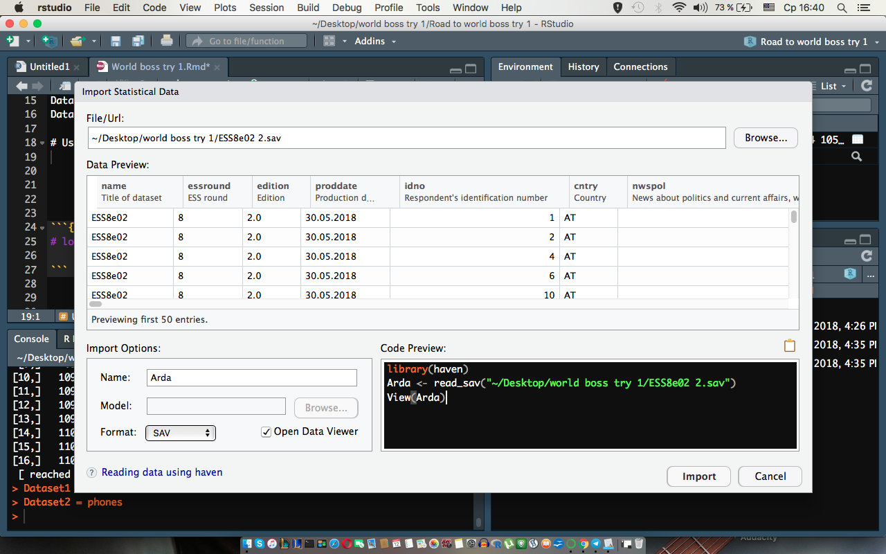

# Quest **"Village1"**
Build in Datasets.
We can cast this ability to look up for interesting packages 'data()'.
Importing 2 build in datasets:
```{r Exploring Datasets, echo = TRUE}
# quest1.1
Numenor <- islands
Angmar <- volcano
head(Numenor)
head(Angmar)
```
Now we need to import our dataset and insert screenshot.
quest1.2
\newpage

\newpage
And this is how we import Dataset manually.

```{r Eriador, echo= TRUE}
# quest1.3
Eriador <- as.data.frame(foreign::read.spss(file = 'ESS8e02 2.sav'))
```


And external link.
```{r Link, echo = TRUE}
# quest1.4
Valinor <- readr::read_csv('http://rgho.st/download/
8hw7SjjfZ/cb9b4192f006768324e
969f0047b25160398868a/
cb9b4192f006768324e969f0047b25160398868a/
LOTR_characters_data.csv')
```

# Quest **"Village2"**
Filtering data and choosing country.
We are going to work with good old Britain.

```{r Filter, echo = TRUE}
# quest2
Arda <- haven::read_sav("ESS8e02 2.sav")
filter <- Arda$cntry == "GB"
MiddleEarth <- Arda[filter,]
```
Exploring Data (4 methods), build-in set.

```{r Numenor, echo = TRUE}
# quest 2.1
str(Numenor)
summary(Numenor) 
Hmisc::describe(Numenor)
skimr::skim(Numenor)
```
Numenor is not very interesting for exploring (Furthermore it sank). It simply gives the lengths (in miles) of 141 “major” rivers in North America, as compiled by the US Geological Survey with no missings/NAs'.
Now lets explore the MiddleEarth! (We will not copy previous code because it will "destroy" our output file (too huge). Let's use only 1 variable to see how it works.

```{r MidEarth, echo = TRUE}
# quest2.2
str(MiddleEarth$wkhtot)
summary(MiddleEarth$wkhtot)
Hmisc::describe(MiddleEarth$wkhtot)
skimr::skim(MiddleEarth$wkhtot)
```

If we explore our MiddleEarth var we can see lot's of missings.This is common for huge survey's with a good amount of variables. We can also notice that nearly 200 variables are all missings. So we can make them zeros There are also variables wich correspond with exect countries, so because of filtering our data some variables are all NAs.
```{r Na, echo = TRUE}
# We can try to get zeros isntead of NA 
MiddleEarth[is.na(MiddleEarth)] = 0
# Check for NA
# is.na(MiddleEarth) 
```
# Quest **"Village3"**
```{r}
# quest3, build in data
# As we saw there are no missing so we can just calculate stats:
mean(Numenor)
sd(Numenor)
var(Numenor)

```

```{r Filtering main, echo = TRUE}
# quest3, Main data
MiddleEarth <- Arda[filter,]
MiddleEarth[is.na(MiddleEarth)] = 0
Shire <- MiddleEarth[colSums(!is.na(MiddleEarth)) > 0]
# To calculate any statistics we should again check for NA
# is.na(Shire)
```
Now we need to perform some statistics. For that lets chose a variable. Let it be "wkhtot" which we can also use for some operations in future.
So, about NA.... We can substitute them to 0 like we did and them calculate statistics like mean, and we can also exclude them manually inside a function.
```{r Stats, echo = TRUE}
# quest3.1
mean(Shire$wkhtot)
sd(Shire$wkhtot)
var(Shire$wkhtot)
```
Then outliers... For exploring outliers we need some plots to be able to explore our variable:
```{r Plots, echo = TRUE}
Bywater <- data.frame(Shire[!is.na(Shire$wkhtot), ])
Bywater <- lapply(Bywater, unclass) 
# Comment for this command: As stackoverflow told me i faced
# some kind of a bug. I got this error sever times
# 'Error: `x` and `labels` must be the same type' which crushed
# everything after itself. To be honest i didn't get why it occured 
# but looks like it may happen with a confcict of Hmisc and haven 
# (according to Stackoverflow atleast). 
# Or maybe i simply use them wrong. Anyway i need this command 
# in order to get any positive result futher.
boxplot(Bywater$wkhtot)
hist(Bywater$wkhtot)
```
So we see outliers of those who are not working and their working time is 0. Also there are observations with more then 80 working hours per week (an even around 120 hours per week). 
Moving to the next quest we need to perform some profound statistics. Our variable 
wkhtot which we used in previous tests is measured in working hours so we can perform one way Anova test with wkhtot as dependent variable. Now let's look for independent which is ment to be categorical. As ind we can take gender variable "gndr". Lets check it.
```{r Bywater, echo = TRUE}
# quest3.2
boxplot(Bywater$wkhtot ~  Bywater$gndr,
xlab = 'Gender', ylab = 'Working hours per week', col=topo.colors(2))
legend("topright", inset=.02, c("Male","Female"),
fill=topo.colors(2), horiz=TRUE, cex=0.8)
#is.na(Bywater$gndr)
#is.na(Bywater$wkhtot)
Hobbiton <- aov(Bywater$gndr ~ Bywater$wkhtot)
summary(Hobbiton)
```
Our model shows that we should reject our 0 hypothesis, so there is a difference between groups(gender) and working hours. 
Next we need to perform some correlation. Lets pick years of education and try to use it with working hours to explore is there any relation between years spent on education and working hours.
```{r Bree, echo = TRUE}
# quest3.2
Bree <- cor.test(Bywater$eduyrs, Bywater$wkhtot, method = "pearson")
Bree
```
According to the results we see there is no huge correlation (0.13) between years of education and working hours.

# Quest **"Village4"**
Now let's move to The Power of Statistics. We are going to cast some regressions using variables from previous chapter. Firsltly we need to look up for assumptions to regression. Let's firslty draw a pictute to look at wkhtot
```{r Green1, echo = TRUE}
# Bywater = Shire[!is.na(Shire$wkhtot), ]
Tuckborough1 <- mean(Bywater$wkhtot, na.rm = TRUE)
Tuckborough2 <- sd(Bywater$wkhtot, na.rm = TRUE)

hist(Bywater$wkhtot,
freq = FALSE,
xlab = 'x',
ylab = 'frequency')
curve(dnorm(x, mean = Tuckborough1, sd = Tuckborough2), add = TRUE,
      lwd = 2)

# And try model:
Green_dragon <-lm(data = Bywater, wkhtot ~  mbtru + gndr + njbspv)
summary(Green_dragon)

# Model is not very good. Our variables are significant
# but r squared is not good enough. So we can try to
# change variable. Let's pick eduyrs
```

```{r Green2, echo = TRUE}
Tuckborough1 <- mean(Bywater$eduyrs, na.rm = TRUE)
Tuckborough2 <- sd(Bywater$eduyrs, na.rm = TRUE)
hist(Bywater$eduyrs,
main = 'Graph1',
freq = FALSE,
xlab = 'x',
ylab = 'frequency')
curve(dnorm(x, mean = Tuckborough1, sd = Tuckborough2),
add = TRUE, lwd = 2)
Green_dragon <- lm(data = Bywater, eduyrs ~ netusoft )
summary(Green_dragon)

```
So this model is better because of the higher R squared. Variable netusoft is significant. However, this model does not provide any valuable information. Our model is telling us that as education increases by 1 year time spent on Internet increases by 0.94535, andthe regression equation is: 
`eduyrs = 9.90313 + 0.94535*netusoft`

```{r Export, echo = TRUE}
# And finaly we should import our models to csv/excel

library(devtools)
library(broom)
Greendragon <- tidy(Green_dragon)
write.csv(Greendragon, "regression.csv")
library(xlsx)
write.xlsx(Greendragon, "regression1.xlsx")
```


